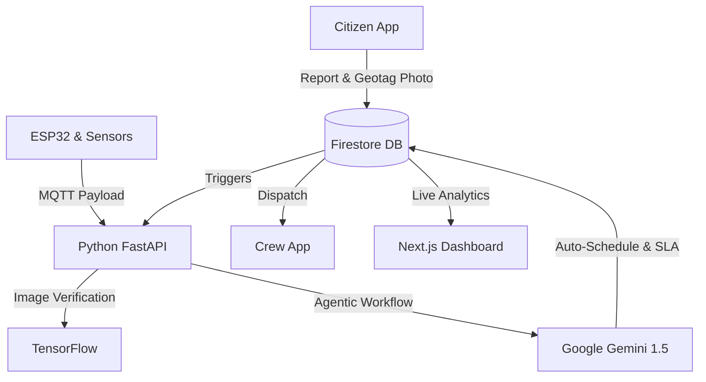

# 🏙️ NAM NAGARAM - Smart City Asset & Complaint Management System


**NAM NAGARAM** is a next-generation, AI-powered municipal management ecosystem designed to bridge the gap between citizens, municipal field crews, and city administrators. Built as part of **Hackwell 2.0**, this project transforms urban maintenance from a reactive, manual process into an autonomous, proactive workflow using Artificial Intelligence and IoT.

---

## ✨ Key Features

### 📱 Dual-Facing Mobile Application (Flutter)
- **Citizen Portal**: Citizens can report infrastructure issues instantly. The app enforces **Geotagging** by embedding exact GPS coordinates into the uploaded photo.
- **Crew Portal**: Field workers receive auto-assigned tasks. Features include **Live GPS Tracking** for admins and a **Temporary Safety Barricade Workflow** to digitally secure hazardous areas (like deep potholes) before full repairs begin.
- **Push Notifications & Rating Agent**: Citizens receive real-time updates on their reports. Once a repair is marked resolved, an AI Rating Agent automatically collects citizen feedback.

### 🧠 Autonomous AI Engine (Python, FastAPI & Google Gemini 1.5)
- **Image Verification Pipeline**: A custom trained TensorFlow/Keras model analyzes uploaded photos and instantly rejects "junk" reports (like photos of laptops or mugs), ensuring only real municipal issues enter the system.
- **Agentic Workflow Dispatcher**: Powered by Gemini 1.5 Flash, the AI assesses issue severity, calculates SLAs, performs intelligent **Duplicate Rejection** (preventing multiple crews from being sent to the same pothole), and automatically dispatches the nearest available crew.

### 💻 Real-Time Admin Dashboard (Next.js)
- A sleek, glassmorphic web portal for city administrators.
- **Live Map**: Real-time tracking of active crews and geolocated complaints.
- **Comprehensive Analytics**: Live KPI charts tracking system health, automated vs. manual task assignments, and IoT vs. Citizen report ratios.

### 📡 Hardware IoT Integration (ESP32 & Ultrasonic Sensors)
- Proactive maintenance via custom hardware communicating over **MQTT protocols**.
- **Ultrasonic Sensors**: Continuously scan for structural anomalies and cracks.
- **ESP32-CAM**: Handles visual asset detection. Upon anomaly detection, the hardware automatically publishes payloads to the backend, generating verified repair tickets before a citizen even notices the problem!

---

## 🏗️ System Architecture



---

## 🛠️ Tech Stack

- **Frontend (Mobile)**: Flutter, Dart
- **Frontend (Web)**: Next.js, React, TailwindCSS, Recharts
- **Backend**: Python, FastAPI, Uvicorn
- **AI/ML**: TensorFlow, Keras, Google Gemini 1.5 API
- **Database & Auth**: Firebase Authentication, Firestore, Firebase Storage
- **Hardware/IoT**: ESP32-CAM, Ultrasonic Sensors, MQTT (Paho-MQTT)

---

## 👥 Meet the Team

Proudly built at **Hackwell 2.0** by:
- **Sarathi**
- **Swarnamalyaa**
- **Vidhya shree**
- **Varshan M**

---

## 🚀 How to Run Locally

### 1. Python AI Backend (`/MunicipalAI`)
```bash
cd MunicipalAI
pip install -r requirements.txt
# Ensure your GEMINI_API_KEY is placed in MunicipalAI/api/.env
python -m uvicorn api.main:app --host 0.0.0.0 --port 8000
```

### 2. Admin Dashboard (`/nam_nagaram_admin`)
```bash
cd nam_nagaram_admin
npm install
npm run dev
```
Access the dashboard at `http://localhost:3000`.

### 3. Flutter Mobile App (`/nam_nagaram`)
```bash
cd nam_nagaram
flutter pub get
flutter run
```
